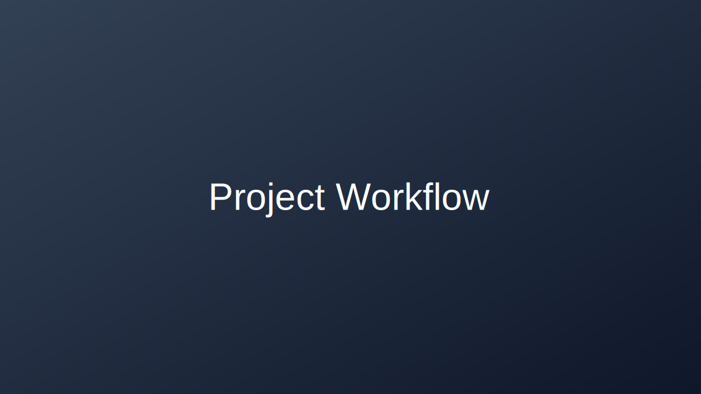

## Who Am I?

I am **[Your Name]**, and this section introduces my academic background, strengths, and long-term professional direction.

[Write a short paragraph about your current program/role and what drives your interest.]

---

## Education

 **[Degree Name]**  
[University / Institution] — [Expected Graduation]

Relevant coursework:

- Machine Learning & Deep Learning  
- [Course / Area]  
- [Course / Area]  
- [Course / Area]  

---

## Technical Skills

::: {.columns}

::: {.column width="50%"}

### Languages & Frameworks
-  **[Language / Tool]** — [Level]
-  **[Language / Tool]** — [Level]
- **[Language / Tool]** — [Level]
- **[Language / Tool]** — [Level]

### Machine Learning
- [Skill / Technique]
- [Skill / Technique]
- [Skill / Technique]
- [Skill / Technique]

:::

::: {.column width="50%"}

### Data & Visualisation
- [Tool]
- [Tool]
- [Tool]

### DevOps & Tools
-  [Tool]
- [Tool]
- [Tool]
- [Tool]

:::

:::

---

## Certifications

| Certification | Issuer | Year |
|---|---|---|
| [Certification Name] | [Issuer] | [Year] |
| [Certification Name] | [Issuer] | [Year] |
| [Certification Name] | [Issuer] | [Year] |

---

## Professional Goals

> *"[Add a personal mission statement here.]"*

My near-term goals include:

- [ ] [Goal 1]  
- [ ] [Goal 2]  
- [ ] [Goal 3]  
- [ ] [Goal 4]  
- [ ] [Goal 5]  

---

## Values & Approach

::: {.callout-tip title="Reproducibility First"}
I believe every data science project should be fully reproducible. All my work is documented with clear code, version-controlled with Git, and published openly where possible.
:::

::: {.callout-note title="Ethical AI"}
I prioritise fairness audits, bias assessments, and transparent model documentation in all projects — especially those targeting sensitive domains like e-commerce and healthcare.
:::

---

## Outside of Work

When I'm not training models or debugging pipelines, you'll find me:

- [Interest / Hobby]  
- [Interest / Hobby]  
- [Interest / Hobby]  
- [Interest / Hobby]  

---

## Multimedia Highlights

{fig-alt="Placeholder image for a future personal workflow diagram"}

  <iframe src="https://www.youtube.com/embed/IsF0yzR4A4s" title="Quarto tutorial video" allowfullscreen></iframe>

*Video source: [Add your selected source title and creator here].*

---

## Attributions

- Icons are provided through the `quarto-ext/fontawesome` extension and Font Awesome Free.
- [Add media/image/video attribution here.]
- [Add adapted code/resource citation here.]
